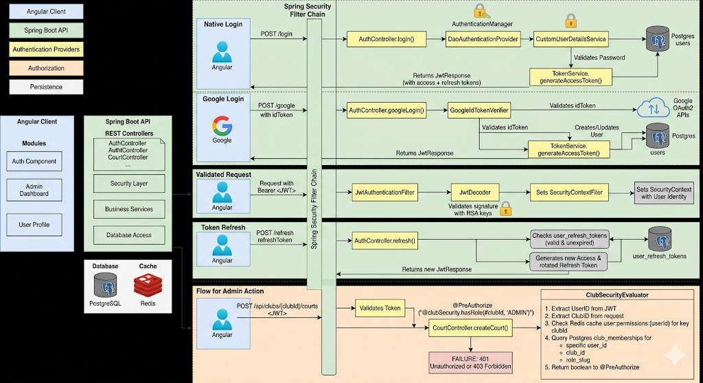
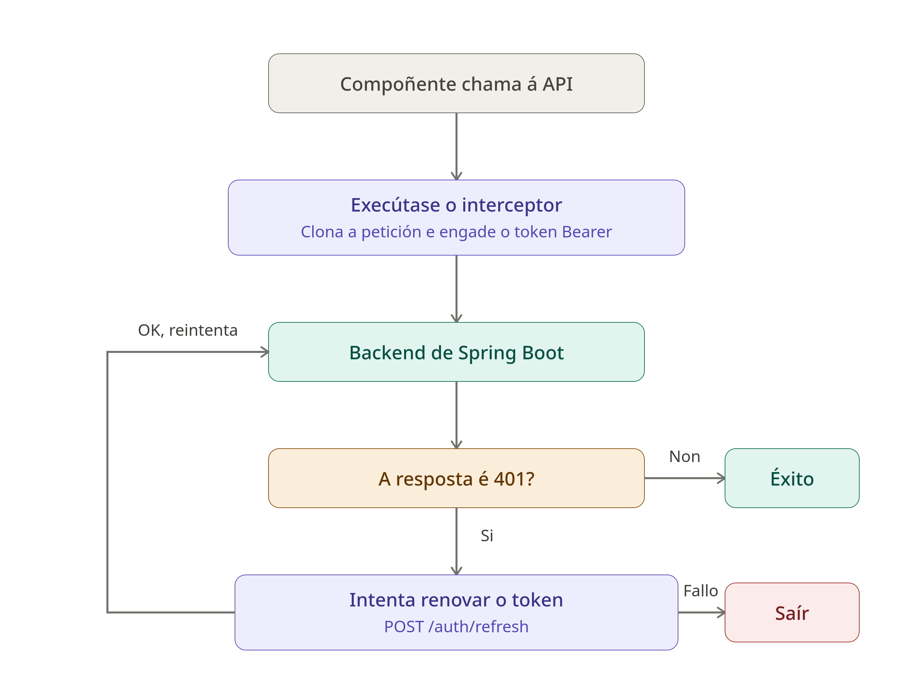

# Arenic, xestión de reservas de pistas deportivas

- [Introducción](#introducción)
- [Estado de arte o análisis del contexto](#estado-de-arte-o-análisis-del-contexto)
- [Propósito](#propósito)
- [Objetivos](#objetivos)
- [Alcance](#alcance)
- [Análise](#análise)
  - [Requerimentos e funcionalidades](#requerimentos-e-funcionalidades)
  - [Base de datos](#base-de-datos)
  - [Desarrollo](#desarrollo)
    - [Creacion de repositorio github](#creacion-de-repositorio-github)
    - [Creacion de VPS e dominio](#creacion-de-vps-en-digitalocean-e-dominio-en-namecheap)
  - [Base do deseño UI e identidade da empresa](#base-do-deseño-ui-e-identidade-da-empresa)
    - [Nome da aplicación](#nome-da-aplicación)
    - [Logo](#logo)
- [Configuración do entorno](#configuración-do-entorno)
  - [Configuración do VPS](#configuración-do-vps)
  - [Entorno local](#entorno-local)
  - [Migracions - Flyway](#migracions)
- [Backend - Springboot](#backend---springboot)
  - [Estructura](#estructura-)
  - [Localizacion de clubs](#localización-de-clubs)
- [TODO: A partir de este punto eres libre de organizar la documentación como estimes pero debes desarrollar el cuerpo de tu proyecto con apartados y subapartados que completen tu documentación](#todo-a-partir-de-este-punto-eres-libre-de-organizar-la-documentación-como-estimes-pero-debes-desarrollar-el-cuerpo-de-tu-proyecto-con-apartados-y-subapartados-que-completen-tu-documentación)
- [Conclusiones](#conclusiones)
- [Referencias, Fuentes consultadas y Recursos externos: Webgrafía](#referencias-fuentes-consultadas-y-recursos-externos-webgrafía)

## Introducción

O presente proxecto ten como obxectivo principal o deseño e desenvolvemento dunha **aplicación web** destinada á reserva e xestión integral de instalacións deportivas. A proposta xorde da necesidade de modernizar a interacción entre os centros deportivos e os seus usuarios, eliminando as barreiras administrativas e fomentando a creación dunha comunidade activa e conectada.

### Funcionalidades para o Usuario (Xogadores)
A aplicación foi concibida baixo unha filosofía *mobile-first*, garantindo unha experiencia de usuario intuitiva e fluída desde calquera dispositivo móbil. Entre as súas capacidades destacan:

* **Sistema de Reservas:** Proceso simplificado para a selección de pistas e horarios en tempo real.
* **Xestión de Competicións:** Ferramentas para a organización e participación en torneos, permitindo un seguimento dinámico de cadros de xogo e clasificacións.
* **Perfil Social e Gamificación:** Os usuarios poderán monitorizar os seus progresos persoais, comparar estatísticas cos perfís da comunidade e outorgar puntuacións aos clubs baseándose na calidade das súas instalacións e servizos.

### Panel de Control para Administradores (Clubs)
Para os propietarios e xestores de centros, a plataforma ofrece un **ecosistema de administración robusto** que permite un control total sobre a operativa diaria:

* **Dashboard Analítico:** Visualización de datos clave mediante gráficos interactivos que facilitan a toma de decisións estratéxicas.
* **Control de Finanzas:** Xestión automatizada de reservas e fluxos de pago de forma segura.
* **Explotación de Datos:** Capacidade para xerar e imprimir informes detallados sobre o rendemento do club, a ocupación das pistas e as métricas de usuarios.

## Estado de arte o análisis del contexto

* **Contexto social:** O auxe dos deportes de raqueta nos últimos anos xerou unha alta demanda de pistas. Os usuarios actuais buscan inmediatez e fuxen das reservas telefónicas ou presenciais.
* **Necesidades a cubrir:**
    * Para o xogador: Atopar pistas dispoñibles en tempo real, organizar torneos de forma sinxela e interactuar con outros xogadores.
    * Para o dono: Dixitalizar a axenda, evitar pistas baleiras e obter métricas de rendemento do club.
* **Competencia:** Existen aplicacións como Playtomic. Aínda que son eficaces, moitos clubs pequenos buscan solucións máis personalizadas ou con menores comisións por reserva. Este proxecto busca replicar as funcións core cun enfoque máis centrado na analítica para o dono.
* **Oportunidade de negocio:** É un modelo SaaS (*Software as a Service*) escalable. Pódese comercializar mediante unha subscrición mensual para os clubs ou unha pequena comisión por transacción de reserva.

## Propósito
O propósito principal é centralizar a xestión deportiva de centros de tenis e pádel nunha aplicación web intuitiva, optimizando o proceso de reserva para o cliente final e profesionalizando a administración diaria para os propietarios dos clubs.

## Objetivos

* **Desenvolvemento técnico:**
    * Implementar un sistema de autenticación seguro con diferentes roles (Xestor / Cliente).
    * Crear un calendario dinámico para a reserva de pistas en tempo real.
    * Deseñar un panel de control para os donos con gráficas de ocupación.
    * Desenvolver un módulo de creación e xestión de torneos.
    * No caso de ser posible por cuestións de tempo, levar a cabo a implementación de un chat en tempo real xogador-xogador e xogador-xestor.
* **Aprendizaxe persoal:**
    * Dominar as tecnoloxías Angular, Springboot, Tailwind e Figma, así como librerías de gráficas e a xestión de pagos.
    * Mellorar no ámbito de seguimento de tarefas e xestión de proxectos.
## Alcance

### O que inclúe:
* **Módulo de Clientes:** Rexistro, procura de pistas dispoñibles por data/hora, confirmación de reservas e historial de partidos.
* **Módulo de Administración:** Xestión de pistas (crear/editar/borrar), visualización de reservas en formato lista e calendario, e xeración de informes en PDF.
* **Analítica:** Panel visual con gráficas de ingresos e horas de maior ocupación.

### O que queda fóra:
* **Chat en tempo real:** Queda marcado como unha mellora futura dependente do tempo dispoñible.
* **Pasarela de pago real:** Realizarase unha simulación de pago, pero non se integrará con Stripe ou PayPal nesta fase.
* **Aplicación Móbil Nativa:** O proxecto centrarase nunha web *responsive* optimizada para móbiles, pero non nunha app de iOS/Android. No caso de seguir
desenvolvendo o proxecto, planificarase unha app para Android.
* **Módulo Social:** Sistema de clasificación/ranking de xogadores baseado en resultados subidos, sistema de amizades entre xogadores con publicación de fotos e textos cos que poder interactuar e sistema de valoración de instalacións (1-5 estrelas). Aínda que no inicio de deseño da aplicación se tiña pensado incluir este apartado, tras a fase de análise e creación da base de datos replantease por cuestións de alcance e tempo de desenvolvemento. 
---

# Análise

## Requerimentos e funcionalidades

A funcionalidade principal da aplicación é a xestión flexible e segura
de pistas deportivas de distintos clubes. Para iso, debense cumplir os seguintes requerimentos:

Contará con **clubes** deportivos, dos cales nos interesa saber o seu nome e dirección, ademais
de poder saber se se atopa ou non activo. Cada clube poderá ter varias **pistas**, das cales
sabemos o tipo de pista, nome e número de pista. A creación de horarios e prezos das pistas
debe ser flexible e permitir a visualización de datos históricos, podendo variar por día da semana
e hora.

Dos **usuarios** interesanos saber o nome completo, email, contrasinal e teléfono móvil. Poderán
estar relacionados con un ou varios clubes, podendo ter varios roles (DONO, EMPREGADO, ENTRENADOR, MEMBRO)
dentro de un clube. Por exemplo, un usuario pode ser dono e entrenador de un clube, o cal lle dará
a posibilidade de dar clases e consultar as análiticas. Ao mesmo tempo pode ser membro de outro clube, o cal
lle permitirá facer reservas con un prezo mais reducido. Un clube sempre terá un usuario creador, o
cal non poderá ser borrado ata a eliminación do clube.

Poderanse realizar **reservas** nas pistas dispoñibles, sendo posible a participación de varios
usuarios na mesma. A aplicación permitirá que os usuarios participantes divídan o custo da reserva,
deixandolles pagar só a sua parte, o prezo completo, ou elixir se queren pagar por algún dos participantes. 
No caso de que algún deles non realice o pago antes da hora posterior a finalización da reserva,
será o usuario que a creou quen pague o restante.

Para facilitar o sistema de pago, os usuarios poderán rexistrar varios **metodos de pago** cos cales
realizar as reservas.

Deseñarase a base de datos tendo en mente que mais adiante se engadiran partidos, entrenos e torneos, entidades que terán
que relacionarse coa tabla de reservas para xestionar a reserva dos participantes.


## Base de datos

Para satisfacer todos os requerimentos funcionales deseñouse o seguinte esquema Entidade-Relación.


### Evolución e problemas

#### Pago de pistas

O problema mais grande co que me estou encontrando é coa lóxica de reserva e pago de pistas.

Nun principio estaba pensado para que na taboa de configuración de prezos de cada pista se indicara o prezo para os membros do club e o prezo normal, o prezo total da pista sería a suma dos participantes. No caso de ser unha persoa soa a que reservara, cobrariaselle a sua praza co prezo de membro no caso de selo e co prezo normal para o resto de prazas anonimas.

Mentras se desarrollaba atopeime con un problema de lóxica o cal non estaba cuberto por este modelo:

O prezo da pista estaba dictado pola cantidade e tipos de xogadores (membros ou non) que participaban
na reserva, pero en ningún campo se indicaba un número mínimo de xogadores ou un prezo base da pista, 
polo que un partido de 2 xogadores pagaríase a metade de prezo que un de 4 xogadores.

Para solucionar esto e ademais facer mais áxil a configuración dos horarios e prezos das pistas modificouse o esquema de base de datos.
1. O usuario creará `PriceRules` indicando o día da semana e a hora de ínicio e fin. 
2. Podendo enlazar a este obxeto un ou mais `PriceRuleIntervals`, os cales indican a duración permitida da reserva (60min, 90min...), prezo total, porcentaxe de desconto para os membros e o modo de xogo no cal se aplica (_*1_) (Individual, Dobles...).
3. Aplica facilmente esta regra en unha ou mais pistas a vez.

Ademais tamen se simplifica o horario de apertura dos clubs, creando a taboa `ClubSchedule` para cada día da semana. No caso de que unha pista teña
un horario distinto ao do clube, simplemente configuranse o seu horario na taboa `PriceRules`, xa que de non dispoñer
prezo para as horas non se poderá reservar.

_*1: controlarase no backend e front que o modo de xogo existe entre as pistas seleccionadas na aplicación da regra, non no deseño de datos, para non complicar o esquema con relacions ternarias_

#### Dias da semana

Para os días da semana gardarase o ordinal, 1(Lunes)-7(Domingo), xa que facilita as queries e os reportes. Como hibernate usa os ORDINAL dende 0, haberá que facer un Conventer para que empece en 1. 

```java
import jakarta.persistence.AttributeConverter;
import jakarta.persistence.Converter;
import java.time.DayOfWeek;

@Converter(autoApply = true) // This automatically protects all DayOfWeek fields in your project
public class DayOfWeekIntegerConverter implements AttributeConverter<DayOfWeek, Integer> {

    @Override
    public Integer convertToDatabaseColumn(DayOfWeek attribute) {
        return attribute != null ? attribute.getValue() : null; // Returns 1 for MONDAY, 7 for SUNDAY
    }

    @Override
    public DayOfWeek convertToEntityAttribute(Integer dbData) {
        return dbData != null ? DayOfWeek.of(dbData) : null; // Maps 1 back to MONDAY, 7 to SUNDAY
    }
}
```

## Desarrollo

Utilizaranse o seguinte stack tecnolóxico:

- Springboot 3.5.14 con Java 21
- Angular 18
- PostgreSQL 17
- Docker e DockerHub
- Github Actions para o despregue. 
  - Jenkins levaría demasiado tempo de configuración e mantemento.
  - Gitlab CI sería a opción mais optima neste caso, pero ao estar enlazado a miña conta de instituto tería que pasar o
  proxecto a github unha vez finalizado o curso, tendo que facer a migración a Github Actions para poder seguin facendo
  cambios na aplicación no futuro.
- DigitalOcean VPS
- Bruno para facer test a api de springboot

### Creacion de repositorio github

Crease un novo repositorio en github para poder usar github actions e configurase git en local para subir os cambios en ambos repositorios:

```shell
git remote add github git@github.com:blancomarinojorge/Arenic.git
git remote set-url --add --push origin git@github.com:blancomarinojorge/Arenic.git
git remote set-url --add --push origin ssh://git@gitlab.iessanclemente.net:60600/dawd/a17jorgebm1.git
```

### Creacion de VPS en Digitalocean e dominio en NameCheap

Crease o vps para o proxecto.

```text
206.189.18.120
arenic.online
```

Configurase o dominio para que apunte ao VPS:

| Type | Host | Value | TTL |
| :--- | :--- | :--- | :--- |
| A Record | www | 206.189.18.120 | 30 min |
| A Record | @ | 206.189.18.120 | 30 min |

## Base do deseño UI e identidade da empresa

### Nome da aplicación

Quero que a aplicación se sinta sofisticada e premium, facendo referencia a elegancia dos deportes de raqueta. Ao mesmo
tempo ten que transmitir a rapidez e a emoción do deporte.

Opcions:
 - Terra
 - Arenic
 - YourCourt
 - OpenCourt

Finalmente decidese o nome **Arenic**, o can fai referencia as pistas de terra batida e as areas nas que se disputan enfrentamentos. Fixose unha busqueda do uso da palabra en outros ámbitos ou aplicacións, sendo esta a menos utilizada e a que mais pode definir a empresa no mercado, dandolle dende un comezo un nome recoñecible e diferenciable.

### Logo

A partir do nome da empresa faise o deseño do logo en figma e gimp, usando a plataforma pinterest como referencia de outros deseños. A continuación mostrase un resumo do proceso de creación a partir de unha imaxe base modificada para satisfacer os requisitos da nosa marca.


Logo final:


---

# Configuración do entorno

## Configuración do VPS

Usarase un único servidor VPS tanto para o frontend como para o backend e configurarase para que use
unha conexión segura mediante o porto 443 facendo que un servidor nginx redirixa a este porto todas
as peticións provintes do 80.

Como o servidor VPS ten poucos recursos, tomouse a decisión de montar as imaxes dende a pipeline de github e subir as imaxes dos contedores
a DockerHub, de esta maneira o VPS só descarga os contedores e iniciaos, gastando moitos menos recursos.

1.  **Facemos update e instalamos Docker:**
    ```bash
    sudo apt update && sudo apt upgrade -y
    sudo apt install ca-certificates curl gnupg lsb-release -y
    # Add Docker’s official GPG key
    sudo mkdir -p /etc/apt/keyrings
    curl -fsSL https://download.docker.com/linux/ubuntu/gpg | sudo gpg --dearmor -o /etc/apt/keyrings/docker.gpg
    # Set up the repository
    echo "deb [arch=$(dpkg --print-architecture) signed-by=/etc/apt/keyrings/docker.gpg] https://download.docker.com/linux/ubuntu $(lsb_release -cs) stable" | sudo tee /etc/apt/sources.list.d/docker.list > /dev/null
    sudo apt update
    sudo apt install docker-ce docker-ce-cli containerd.io docker-compose-plugin -y
    ```
2.  Crease o usuario `deployer`:
    ```bash
    adduser deployer
    usermod -aG sudo,docker deployer
    ```
3. Configuro a clave publica ssh no usuario deployer para poder acceder con el por ssh:
    ```bash
    # 1. Create the .ssh directory for the deployer user (if it doesn't exist)
    mkdir -p /home/deployer/.ssh
    
    # 2. Copy the authorized_keys from root to deployer
    cp /root/.ssh/authorized_keys /home/deployer/.ssh/
    
    # 3. Change ownership so the 'deployer' user actually owns the file
    chown -R deployer:deployer /home/deployer/.ssh
    
    # 4. Set the strict permissions SSH requires
    chmod 700 /home/deployer/.ssh
    chmod 600 /home/deployer/.ssh/authorized_keys
    ```

3.  **Crease o directorio da aplicación, onde se subirán os cambios e se atopará o arquivo `.env`, arquivo necesario para que funcione docker-compose no momento de facer o despregue. É o único arquivo que se subirá manualmente por motivos de seguridade:**
    ```bash
    mkdir -p /home/deployer/app
    chown deployer:deployer /home/deployer/app
    ```
4. Como usuario **deployer** creo e configuro o arquivo .env:
    ```bash
    nano /home/deployer/app/.env
    ```
5. Indicar que no docker-compose limitase o acceso público a base de datos, solo deixando acceder mediante dende localhost (para acceder a do VPS usarase SSH):
    ```yaml
    # I don't actually want to expose the port to the internet, so I only map the port to localhost.
    # This way, we can access this port via SSH to the VPS but keeping it secure.
    ports:
      - "127.0.0.1:5432:5432"
    ```
   
### Configuración nginx con SSL

Para servir as peticións ao exterior contaremos con un contedor docker de nginx, configurado na carpeta
_/frontend/nginx.conf_. Configurarase para que sirva as peticións dirixidas a `/` ao frontend e `/api` ao
backend. Para configurar SSL usarase **certbot**.

1. Creanse as carpetas donde certbot deixará os ficheiros, para que docker non as cree automaticamente con permisos de root.
    ```bash
   #como usuario deployer
    mkdir -p /home/deployer/app/certbot/conf /home/deployer/app/certbot/www
    ```

2. Faise o deployment por primeira vez tendo solo a configuración para o porto **80** en nginx.
    ```text
    server {
        listen 80;
        server_name arenic.online www.arenic.online;
    
        # Certbot challenge location
        location /.well-known/acme-challenge/ {
            root /var/www/certbot;
        }
    
        # Redirect all HTTP traffic to HTTPS
        location / {
            return 301 https://$host$request_uri;
        }
    }
    ```

3. Generanse as claves SSL e descomentase a configuración para https de nginx:

    ```bash
    docker run -it --rm --name certbot -v "/home/deployer/app/certbot/conf:/etc/letsencrypt" -v "/home/deployer/app/certbot/www:/var/www/certbot" certbot/certbot certonly --webroot -w /var/www/certbot -d arenic.online -d www.arenic.online
    ```
   
4. Configuro o porto 433 na configuración de nginx e fago commit para que se volva a facer o despregue, esta vez co ssl habilitado.

## Entorno local

No entorno de desarrollo usaremos o arquivo `docker-compose.local.yml`, que unicamente conten o contedor para lanzar a base de datos PostgreSQL. Para lanzalo:

```shell
#dende a carpeta raíz do proxecto
docker compose -f docker-compose.local.yml up -d
```

Para correr as aplicacións, debugear e desarrollar usaremos as ferramentas de java e angular respectivamente.

```shell
#no caso de querer compilar o proxecto backend dende terminal
mvn clean install
java -jar target/backend-0.0.1-SNAPSHOT.jar
```

## Migracions

Para as migracions usarase **Flyway**, o can nos permite gardar un historial dos cambios da nosa base de datos na taboa `/resources/db/migration` e executando os scripts que sean necesarios cada vez que se reinicie a aplicación.

Escollese esta ferramenta antes que depender de **Hibernate** xa que deixa unha traza dos cambios ao longo do tempo en arquivos `.sql,` permitindo facer migracións sen necesidade da aplicación.

### Tests e local

Por defecto, Flyway non permite borrar un arquivo de migración unha vez executado. Para facer probas e non ter que deixar un rastro de arquivos de proba podese executar este comando para resetear o seguimento de flyway e poder borrar arquivos:

```shell
./mvnw flyway:clean -Dspring.flyway.url=jdbc:postgresql://localhost:5432/myappdb -Dspring.flyway.user=your_user -Dspring.flyway.password=your_password -Dflyway.cleanDisabled=false
```

---

# Backend - Springboot

## Estructura 

Optarase por un **Monolito Modular** para a estructura do backend, separando as distintas unidades de negocio claves da aplicación en módulos separados.

Con esto o que se pretende é seguir garantir un alto grado de cohesión e un **baixo acoplamento** entre os compoñentes, facendo que os módulos non dependan estreitamente uns dos outros e conseguindo que
a aplicación sexa mais escalable no caso de ser preciso nun futuro. 

Nun primeiro momento pretendiase que cada un dos módulos só se comunicará cos
demais mediante os _Services_ dispoñibles, non accedendo nunca aos _Repository_ externos directamente e non realizando consultas sql as taboas dos módulos externos.
Finalmente esta idea descartase xa que complicaría moito as transaccións e o uso de Hibernate, privandonos de comodidades como os joins mediante `ManyToOne`, tendo
que facer o mappeo de obxetos manualmente. Para un equipo e proxecto mais grande sería o común, pero para un proxecto de 1 persoa relentizaría e complicaría o desarrollo
innecesariamente.

Contaremos con 4 módulos principais:

* **Identity**: encargado da xestión de usuarios e acceso a aplicación
* **Club**: CRUD de Clubs, Pistas, Membresías e regras de prezos e horarios.
* **Booking**: xestionará as reservas. 
* **Payment**: xestionará os pagos e as conexións coas apis bancarias.


Quedando unha estructura inicial:

```text
com.arenic.backend/
├── common/                               # Lóxica compartida
│   ├── exception/
│   │   ├── BusinessException.java
│   │   ├── GlobalExceptionHandler.java
│   │   └── ResourceNotFoundException.java
│   ├── dto/
│   │   ├── ApiResponse.java
│   │   └── ErrorResponse.java
│   └── util/
│       ├── DateTimeUtils.java
│       └── PaginationUtils.java
│
├── config/                               # Configuración da infraestructura
│   ├── security/
│   │   ├── JwtAuthenticationFilter.java
│   │   ├── SecurityConfig.java
│   │   └── UserPrincipal.java
│   └── persistence/
│       ├── JpaAuditConfig.java
│       └── DataSourceConfig.java
│
├── modules/                              # Módulos de negocio
│   ├── identity/                         
│   │   ├── api/                          # Api
│   │   │   ├── IdentityService.java
│   │   │   └── UserDTO.java
│   │   └── internal/                     # Implementación oculta
│   │       ├── controller/
│   │       │   └── AuthController.java
│   │       ├── model/
│   │       │   └── User.java
│   │       ├── repository/
│   │       │   └── UserRepository.java
│   │       └── service/
│   │           └── IdentityServiceImpl.java
│   │
│   ├── club/                             
│   │   ├── api/                          
│   │   │   ├── ClubService.java
│   │   │   ├── CourtDTO.java
│   │   │   └── MembershipDTO.java
│   │   └── internal/                     
│   │       ├── controller/
│   │       │   ├── ClubController.java
│   │       │   └── CourtController.java
│   │       ├── model/
│   │       │   ├── Club.java
│   │       │   ├── Court.java
│   │       │   ├── Membership.java
│   │       │   ├── MembershipId.java
│   │       │   └── PriceConfiguration.java
│   │       ├── repository/
│   │       │   ├── ClubRepository.java
│   │       │   ├── CourtRepository.java
│   │       │   └── MembershipRepository.java
│   │       └── service/
│   │           ├── ClubServiceImpl.java
│   │           └── PricingCalculator.java
│   │
│   ├── booking/                          
│   │   ├── api/                          
│   │   │   ├── BookingService.java
│   │   │   └── BookingDTO.java
│   │   └── internal/                     
│   │       ├── controller/
│   │       │   └── BookingController.java
│   │       ├── model/
│   │       │   └── Booking.java          
│   │       ├── repository/
│   │       │   └── BookingRepository.java
│   │       ├── mapper/
│   │       │   └── BookingDataStitcher.java
│   │       └── service/
│   │           └── BookingServiceImpl.java
│   │
│   └── payment/                          
│       ├── api/                          
│       │   ├── PaymentService.java
│       │   └── PaymentStatusDTO.java
│       └── internal/                     
│           ├── controller/
│           │   └── PaymentWebhookController.java
│           ├── model/
│           │   └── Payment.java          
│           ├── repository/
│           │   └── PaymentRepository.java
│           ├── gateway/
│           │   ├── StripeProvider.java
│           │   └── PaymentGatewayInterface.java
│           └── service/
│               └── PaymentServiceImpl.java
│
└── BackendApplication.java               # Entry Point da aplicación
```

## Documentación de api

Usarase swagger para a documentación da api, a cal poderá ser accesible localmente mendiante
a url `http://localhost:8080/api/swagger-ui/index.html#/`.


## Localización de clubs

- Spatial Data: If you want to search by map coordinates (latitude/longitude), don't just use Double. Look into PostGIS (if using PostgreSQL) or the Hibernate Spatial library. It allows you to do professional queries like "find all clubs within 10km of these coordinates" efficiently.
- API interesante: https://photon.komoot.io/

Proceso pensado:
1. Usar a api cando estan creando o club para que poidan buscar a dirección exacta
2. Gardar a dirección na bd na tabla `locations`
3. Cando o usuario busca por pistas buscar en locations

Nun principio podo facer a query e se hai tempo nun futuro usar **PostGIS**. Query exemplo:

```sql
-- Find clubs within :radius km of a user
SELECT c.*, 
       (6371 * acos(cos(radians(:userLat)) * cos(radians(l.latitude)) 
       * cos(radians(l.longitude) - radians(:userLng)) + sin(radians(:userLat)) 
       * sin(radians(l.latitude)))) AS distance
FROM clubs c
JOIN locations l ON c.location_id = l.id
WHERE (6371 * acos(cos(radians(:userLat)) * cos(radians(l.latitude)) 
       * cos(radians(l.longitude) - radians(:userLng)) + sin(radians(:userLat)) 
       * sin(radians(l.latitude)))) < :radius
ORDER BY distance ASC;
```

## Seguridade - Spring Security

Version: `6.5.10`

### Implementación de Criptografía Asimétrica (RSA)

Neste proxecto, optei por utilizar **RSA (RS256)** en lugar de **HMAC (HS256)** para a sinatura de tokens JWT. Esta decisión fundaméntase en mellorar a seguridade 
e a escalabilidade do sistema mediante os seguintes criterios técnicos:

* **Descentralización da Verificación:** Ao usar RSA, o servidor de recursos pode utilizar o método `NimbusJwtDecoder.withPublicKey()` de Spring Security. 
Esto permite verificar a integridade dos tokens de forma autónoma, sen necesidade de establecer unha conexión directa ou compartir claves privadas co servidor de autorización.
* **Eliminación de Segredos Compartidos:** A diferenza de HMAC, que obriga a expoñer a mesma clave secreta no ficheiro `application.yml` de cada microservizo, 
RSA permite que os servizos só coñezan a **clave pública**. Isto reduce drasticamente o risco: se un servizo se ve comprometido, o atacante non poderá xerar novos tokens fraudulentos.
* **Separación de Responsabilidades (Separation of Concerns):** Seguindo os principios de seguridade de "mínimo privilexio", o Servidor de Autorización mantén a exclusividade
da clave privada (capacidade de escrita/sinatura), mentres que os Servidores de Recursos só posúen a clave pública (capacidade de lectura/verificación), illando así as funcións críticas do sistema.

Aínda que actualmente o servidor de autorización e o de recursos residen na mesma instancia, a elección de RSA garante o desacoplamento das capas de seguridade. Isto facilita 
a transición cara a unha arquitectura de microservizos ou a integración dun sistema SSO (Single Sign-On) sen modificacións estruturais, asegurando a escalabilidade do sistema.

### Esquema de autenticación




---

# Frontend

### Creación do proxecto

- Angular 18 (standalone components + signals)
- Tailwind CSS
- Vite (via @angular-devkit/build-angular)
- No component library

```shell
# creamos o proxecto
npx @angular/cli@18 new frontend --routing --style=css --ssr=false
# instalamos a depedencias de tailwind, gardandoas no package.json como dependencias
# de desarrollo, xa que non son necesarias en PRD
npm install -D tailwindcss postcss autoprefixer
# creamos o arquivo de configuración de tailwind
npx tailwindcss init
```

#### Estructura inicial:

```text
src/app/
├── core/
│   └── auth/
│       ├── auth.models.ts
│       ├── auth.service.ts
│       ├── auth.interceptor.ts
│       └── auth.guard.ts
├── features/
│   ├── auth/
│   │   └── login/
│   │       ├── login.component.ts
│   │       └── login.component.html
│   └── dashboard/
│       └── dashboard.component.ts
├── app.config.ts
└── app.routes.ts
```

## Intercepción de request

Crearase un interceptor o cal se executará en todas as request http. Este engadirá o token jwt
identificativo nas peticións ao backend e interceptará os erros `401`, intentando usar o token
de refresco no caso de estar dispoñible para conseguir un novo token identificativo.




---

# Extras
## TODO: A partir de este punto eres libre de organizar la documentación como estimes pero debes desarrollar el cuerpo de tu proyecto con apartados y subapartados que completen tu documentación

> Hemos elaborado un [checklist](checklist.md) de puntos necesarios para tu PFC, para que revises estas recomendaciones/especificaciones.
> Apóyate en tu tutor/a si tienes duda de cómo organizar tu proyecto y estos apartados/subapartado. Cada proyecto y su contexto determinará la mejor forma de estructurarlo. Piensa bien cómo lo vas a hacer.

## Conclusiones

> Deja esta apartado para el final. Realiza un resumen de todo lo que ha supuesto la realización de tu proyecto. Debe ser una redacción breve. Un resumen de los hitos conseguidos más importantes y de lo aprendido durante el proceso.
> Puede ser un buen punto de partida para organizar tu presentación y ajustarla al tiempo que tienes.

## Referencias, Fuentes consultadas y Recursos externos: Webgrafía

> *TODO*: Enlaces externos y descipciones de estos enlaces que creas conveniente indicar aquí. Generalmente ya van a estar integrados con tu documentación, pero si requieres realizar un listado de ellos, este es el lugar.

- [Deploy con Docker y Ubuntu en 5 minutos (y mas) - Nginx y Certbot](https://www.youtube.com/watch?v=Hz_Jr2I_n8w)
- [Crash course Angular](https://www.youtube.com/watch?v=oUmVFHlwZsI&t=628s)
- [Install letsencrypt](https://www.inmotionhosting.com/support/website/ssl/lets-encrypt-ssl-ubuntu-with-certbot/)
- [Flyway](https://www.baeldung.com/database-migrations-with-flyway)
- [O2Auth and OpenId connect, JWT](https://www.youtube.com/watch?v=t18YB3xDfXI)
- [Bruno for making api request](https://www.usebruno.com/)
- [Jwt explained](https://www.youtube.com/watch?v=Y2H3DXDeS3Q)
- [Spring security archichecture](https://www.youtube.com/watch?v=h-9vhFeM3MY)
- [Tabler icons](https://github.com/tabler/tabler-icons?checkout%5Bcustom%5D%5Bph_distinct_id%5D=019e936e-adef-70a0-a5a4-a657724cf783&reference_id=019e936e-adef-70a0-a5a4-a657724cf783)