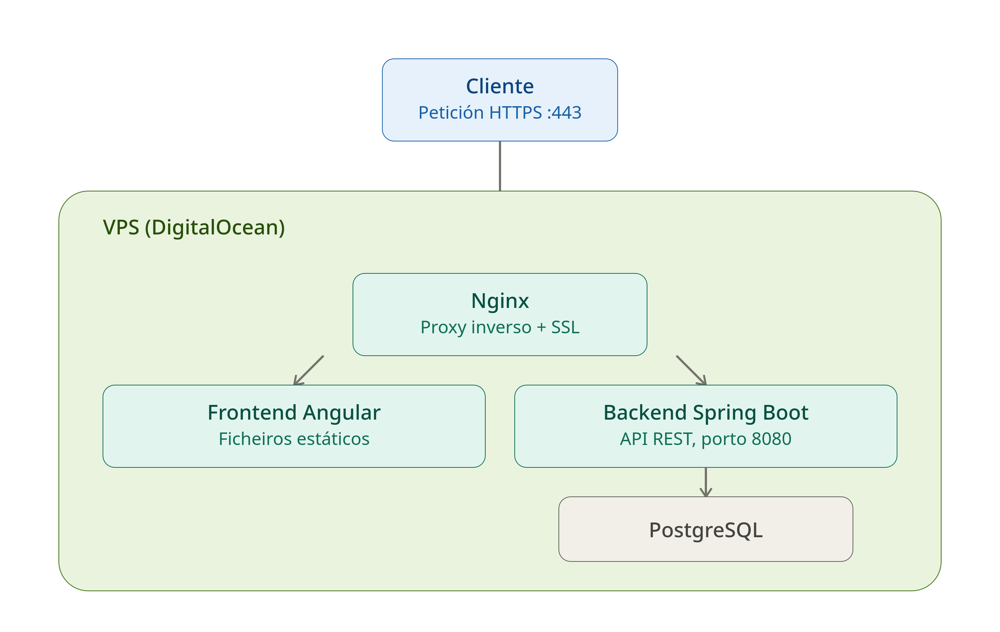
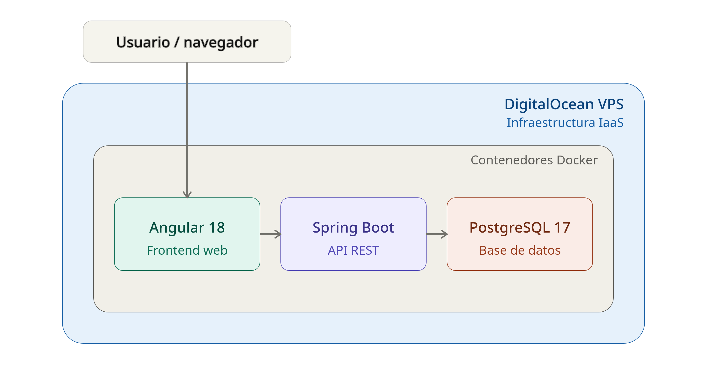
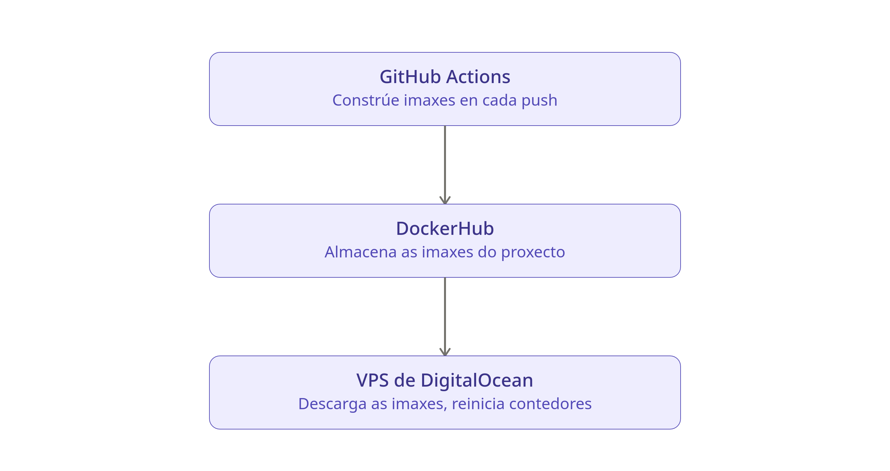
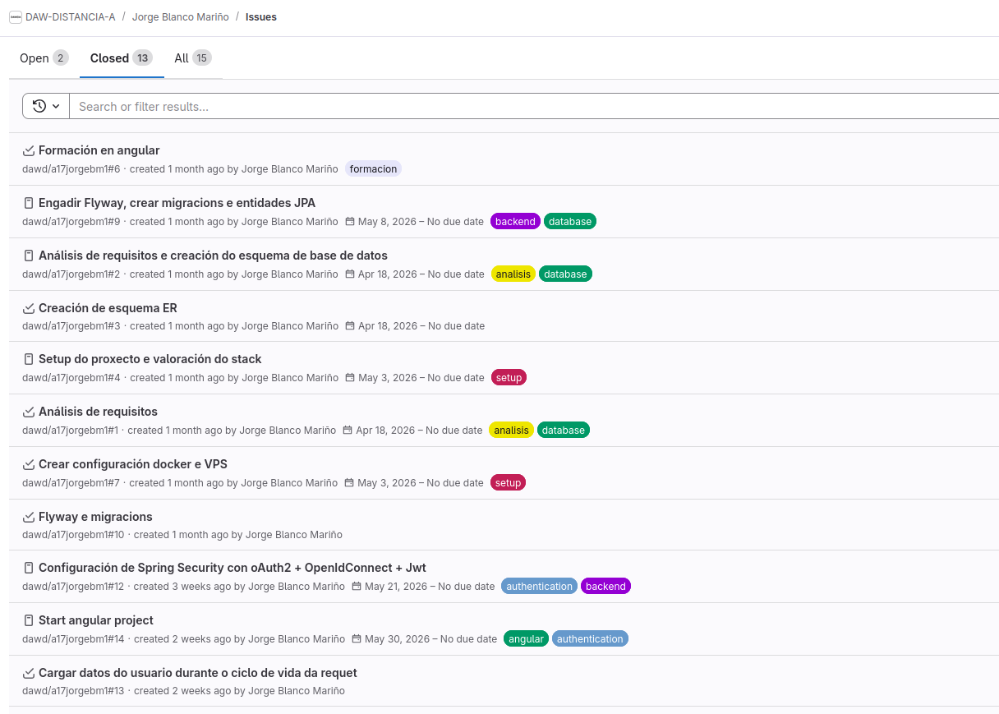

# Arenic, xestión de reservas de pistas deportivas

- [Introducción](#introducción)
    - [Funcionalidades para o Usuario (Xogadores)](#funcionalidades-para-o-usuario-xogadores)
    - [Panel de Control para Administradores (Clubs)](#panel-de-control-para-administradores-clubs)
- [Estado de arte o análisis del contexto](#estado-de-arte-o-análisis-del-contexto)
- [Propósito](#propósito)
- [Objetivos](#objetivos)
- [Alcance](#alcance)
    - [O que inclúe](#o-que-inclúe)
    - [O que queda fóra](#o-que-queda-fóra)
- [Análise](#análise)
    - [Requerimentos e funcionalidades](#requerimentos-e-funcionalidades)
    - [Base de datos](#base-de-datos)
        - [Evolución e problemas](#evolución-e-problemas)
            - [Pago de pistas](#pago-de-pistas)
            - [Dias da semana](#dias-da-semana)
    - [Desarrollo](#desarrollo)
        - [Creacion de repositorio github](#creacion-de-repositorio-github)
        - [Creacion de VPS e dominio](#creacion-de-vps-en-digitalocean-e-dominio-en-namecheap)
    - [Base do deseño UI e identidade da empresa](#base-do-deseño-ui-e-identidade-da-empresa)
        - [Nome da aplicación](#nome-da-aplicación)
        - [Logo](#logo)
- [Configuración do entorno](#configuración-do-entorno)
    - [Configuración do VPS](#configuración-do-vps)
        - [Configuración nginx con SSL](#configuración-nginx-con-ssl)
    - [Entorno local](#entorno-local)
    - [Migracions - Flyway](#migracions)
        - [Tests e local](#tests-e-local)
- [Backend - Springboot](#backend---springboot)
    - [Estructura](#estructura-)
    - [Localizacion de clubs](#localización-de-clubs)
    - [Documentación de api](#documentación-de-api)
    - [Seguridade - Spring Security](#seguridade---spring-security)
        - [Implementación de Criptografía Asimétrica (RSA)](#implementación-de-criptografía-asimétrica-rsa)
        - [Esquema de autenticación](#esquema-de-autenticación)
- [Frontend](#frontend)
    - [Creación do proxecto](#creación-do-proxecto)
        - [Estructura inicial](#estructura-inicial)
    - [Intercepción de request](#intercepción-de-request)
- [Extras](#extras)
    - [TODO: A partir de este punto eres libre de organizar la documentación como estimes pero debes desarrollar el cuerpo de tu proyecto con apartados y subapartados que completen tu documentación](#todo-a-partir-de-este-punto-eres-libre-de-organizar-la-documentación-como-estimes-pero-debes-desarrollar-el-cuerpo-de-tu-proyecto-con-apartados-y-subapartados-que-completen-tu-documentación)
    - [Conclusiones](#conclusiones)
    - [Referencias, Fuentes consultadas y Recursos externos: Webgrafía](#referencias-fuentes-consultadas-y-recursos-externos-webgrafía)
## Introducción

O presente proxecto ten como obxectivo principal o deseño e desenvolvemento dunha **aplicación web** destinada á reserva de instalacións deportivas. A proposta xorde da necesidade de modernizar a interacción entre os centros deportivos e os seus usuarios, eliminando as barreiras administrativas no proceso de reserva.

### Funcionalidades para o Usuario (Xogadores)
A aplicación foi concibida baixo unha filosofía *mobile-first*, garantindo unha experiencia de usuario intuitiva e fluída desde calquera dispositivo móbil. Entre as súas capacidades destaca:

* **Sistema de Reservas:** Proceso simplificado para a selección de pistas e horarios en tempo real.

### Panel de Control para Administradores (Clubs)
Para os propietarios e xestores de centros, a plataforma ofrece un **panel de administración básico** que permite xestionar a operativa diaria das instalacións:

* **Xestión de Pistas:** Alta, modificación e eliminación das pistas dispoñibles no club.
* **Xestión de Horarios:** Configuración da dispoñibilidade horaria de cada pista para que os usuarios poidan reservar.

## Estado de arte o análisis del contexto

* **Contexto social:** O auxe dos deportes de raqueta nos últimos anos xerou unha alta demanda de pistas. Os usuarios actuais buscan inmediatez e fuxen das reservas telefónicas ou presenciais.
* **Necesidades a cubrir:**
    * Para o xogador: Atopar e reservar pistas dispoñibles en tempo real, sen necesidade de chamar ou acudir ao club.
    * Para o dono: Dixitalizar a axenda de reservas e evitar pistas baleiras por unha xestión manual ineficiente.
* **Competencia:** Existen aplicacións como Playtomic. Aínda que son eficaces, moitos clubs pequenos buscan solucións máis sinxelas e personalizadas, sen as comisións ou complexidade dunha plataforma máis grande. Este proxecto busca replicar as funcións core de reserva (usuario + xestión básica de pistas e horarios), cun enfoque sinxelo e directo.
* **Oportunidade de negocio:** É un modelo escalable que se podería comercializar mediante unha pequena subscrición mensual por club, ofrecendo unha alternativa lixeira fronte a solucións máis complexas do mercado.
## Propósito
O propósito principal é centralizar a xestión deportiva de centros de tenis e pádel nunha aplicación web intuitiva, optimizando o proceso de reserva para o cliente final e profesionalizando a administración diaria para os propietarios dos clubs.

## Objetivos

* **Desenvolvemento técnico:**
    * Implementar un sistema de autenticación seguro con diferentes roles (Xestor / Cliente).
    * Crear un calendario dinámico para a reserva de pistas en tempo real.
    * Deseñar un panel de control para os donos con gráficas de ocupación.
    * Desenvolver un módulo de creación e xestión de torneos.
    * No caso de ser posible por cuestións de tempo, levar a cabo a implementación de un chat en tempo real xogador-xogador e xogador-xestor.
* **Aprendizaxe persoal:**
    * Dominar as tecnoloxías Angular, Springboot, Tailwind e Figma, así como librerías de gráficas e a xestión de pagos.
    * Mellorar no ámbito de seguimento de tarefas e xestión de proxectos.
## Alcance

### O que inclúe:
* **Módulo de Clientes:** Rexistro, procura de pistas dispoñibles por data/hora, confirmación de reservas e historial de partidos.
* **Módulo de Administración:** Xestión de pistas (crear/editar/borrar), visualización de reservas en formato lista e calendario, e xeración de informes en PDF.
* **Analítica:** Panel visual con gráficas de ingresos e horas de maior ocupación.

### O que queda fóra:
* **Chat en tempo real:** Queda marcado como unha mellora futura dependente do tempo dispoñible.
* **Pasarela de pago real:** Realizarase unha simulación de pago, pero non se integrará con Stripe ou PayPal nesta fase.
* **Aplicación Móbil Nativa:** O proxecto centrarase nunha web *responsive* optimizada para móbiles, pero non nunha app de iOS/Android. No caso de seguir
desenvolvendo o proxecto, planificarase unha app para Android.
* **Módulo Social:** Sistema de clasificación/ranking de xogadores baseado en resultados subidos, sistema de amizades entre xogadores con publicación de fotos e textos cos que poder interactuar e sistema de valoración de instalacións (1-5 estrelas). Aínda que no inicio de deseño da aplicación se tiña pensado incluir este apartado, tras a fase de análise e creación da base de datos replantease por cuestións de alcance e tempo de desenvolvemento. 
---

# Análise

## Requerimentos e funcionalidades

A funcionalidade principal da aplicación é a xestión flexible e segura
de pistas deportivas de distintos clubes. Para iso, debense cumplir os seguintes requerimentos:

Contará con **clubes** deportivos, dos cales nos interesa saber o seu nome e dirección, ademais
de poder saber se se atopa ou non activo. Cada clube poderá ter varias **pistas**, das cales
sabemos o tipo de pista, nome e número de pista. A creación de horarios e prezos das pistas
debe ser flexible e permitir a visualización de datos históricos, podendo variar por día da semana
e hora.

Dos **usuarios** interesanos saber o nome completo, email, contrasinal e teléfono móvil. Poderán
estar relacionados con un ou varios clubes, podendo ter varios roles (DONO, EMPREGADO, ENTRENADOR, MEMBRO)
dentro de un clube. Por exemplo, un usuario pode ser dono e entrenador de un clube, o cal lle dará
a posibilidade de dar clases e consultar as análiticas. Ao mesmo tempo pode ser membro de outro clube, o cal
lle permitirá facer reservas con un prezo mais reducido. Un clube sempre terá un usuario creador, o
cal non poderá ser borrado ata a eliminación do clube.

Poderanse realizar **reservas** nas pistas dispoñibles, sendo posible a participación de varios
usuarios na mesma. A aplicación permitirá que os usuarios participantes divídan o custo da reserva,
deixandolles pagar só a sua parte, o prezo completo, ou elixir se queren pagar por algún dos participantes. 
No caso de que algún deles non realice o pago antes da hora posterior a finalización da reserva,
será o usuario que a creou quen pague o restante.

Para facilitar o sistema de pago, os usuarios poderán rexistrar varios **metodos de pago** cos cales
realizar as reservas.

Deseñarase a base de datos tendo en mente que mais adiante se engadiran partidos, entrenos e torneos, entidades que terán
que relacionarse coa tabla de reservas para xestionar a reserva dos participantes.


## Base de datos

Para satisfacer todos os requerimentos funcionales deseñouse o seguinte esquema Entidade-Relación.


### Evolución e problemas

#### Pago de pistas

O problema mais grande co que me estou encontrando é coa lóxica de reserva e pago de pistas.

Nun principio estaba pensado para que na taboa de configuración de prezos de cada pista se indicara o prezo para os membros do club e o prezo normal, o prezo total da pista sería a suma dos participantes. No caso de ser unha persoa soa a que reservara, cobrariaselle a sua praza co prezo de membro no caso de selo e co prezo normal para o resto de prazas anonimas.

Mentras se desarrollaba atopeime con un problema de lóxica o cal non estaba cuberto por este modelo:

O prezo da pista estaba dictado pola cantidade e tipos de xogadores (membros ou non) que participaban
na reserva, pero en ningún campo se indicaba un número mínimo de xogadores ou un prezo base da pista, 
polo que un partido de 2 xogadores pagaríase a metade de prezo que un de 4 xogadores.

Para solucionar esto e ademais facer mais áxil a configuración dos horarios e prezos das pistas modificouse o esquema de base de datos.
1. O usuario creará `PriceRules` indicando o día da semana e a hora de ínicio e fin. 
2. Podendo enlazar a este obxeto un ou mais `PriceRuleIntervals`, os cales indican a duración permitida da reserva (60min, 90min...), prezo total, porcentaxe de desconto para os membros e o modo de xogo no cal se aplica (_*1_) (Individual, Dobles...).
3. Aplica facilmente esta regra en unha ou mais pistas a vez.

Ademais tamen se simplifica o horario de apertura dos clubs, creando a taboa `ClubSchedule` para cada día da semana. No caso de que unha pista teña
un horario distinto ao do clube, simplemente configuranse o seu horario na taboa `PriceRules`, xa que de non dispoñer
prezo para as horas non se poderá reservar.

_*1: controlarase no backend e front que o modo de xogo existe entre as pistas seleccionadas na aplicación da regra, non no deseño de datos, para non complicar o esquema con relacions ternarias_

#### Dias da semana

Para os días da semana gardarase o ordinal, 1(Lunes)-7(Domingo), xa que facilita as queries e os reportes. Como hibernate usa os ORDINAL dende 0, haberá que facer un Conventer para que empece en 1. 

```java
import jakarta.persistence.AttributeConverter;
import jakarta.persistence.Converter;
import java.time.DayOfWeek;

@Converter(autoApply = true)
public class DayOfWeekIntegerConverter implements AttributeConverter<DayOfWeek, Integer> {

    @Override
    public Integer convertToDatabaseColumn(DayOfWeek attribute) {
        return attribute != null ? attribute.getValue() : null; // Returns 1 for MONDAY, 7 for SUNDAY
    }

    @Override
    public DayOfWeek convertToEntityAttribute(Integer dbData) {
        return dbData != null ? DayOfWeek.of(dbData) : null; // Maps 1 back to MONDAY, 7 to SUNDAY
    }
}
```


## Desarrollo

Utilizaranse o seguinte stack tecnolóxico:

- Springboot 3.5.14 con Java 21
- Angular 18
- PostgreSQL 17
- Docker e DockerHub
- Github Actions para o despregue. 
  - Jenkins levaría demasiado tempo de configuración e mantemento.
  - Gitlab CI sería a opción mais optima neste caso, pero ao estar enlazado a miña conta de instituto tería que pasar o
  proxecto a github unha vez finalizado o curso, tendo que facer a migración a Github Actions para poder seguin facendo
  cambios na aplicación no futuro.
- DigitalOcean VPS
- Bruno para facer test a api de springboot

### Arquitectura

Para o meu proxecto decidín empregar a seguinte arquitectura de software e infraestrutura:

**Frontend**

Para a parte cliente decidín utilizar Angular 18. Encárgase de toda a interface de usuario e consome a API REST exposta polo backend. Optei por compilalo como unha SPA (Single Page Application) e servila como contido estático dentro dun contedor Docker.

**Backend**

Para a lóxica de negocio e a exposición da API REST escollín Spring Boot 3.5.14 sobre Java 21. É o encargado de procesar as peticións do frontend, aplicar a lóxica da aplicación e comunicarse coa base de datos. Implementeino como un único servizo, sen dividilo en compoñentes máis pequenos.

**Base de datos**

Para a persistencia dos datos optei por PostgreSQL 17, ao ser unha base de datos relacional robusta e con boa integración con Spring Boot a través de JPA/Hibernate.

**Infraestrutura e software de soporte**

- Utilicei Docker para empaquetar tanto o frontend como o backend en contedores independentes, o que me permite ter un entorno reproducible tanto en desenvolvemento como en produción.
- Para almacenar as imaxes Docker xeradas, decidín utilizar DockerHub como rexistro de imaxes.
- Para a automatización do despregue elixín GitHub Actions. Valorei outras alternativas como Jenkins, que descartei por levar demasiado tempo de configuración e mantemento, e GitLab CI, que tería sido a opción máis óptima neste caso pero, ao estar ligada á miña conta de instituto, obrigaríame a migrar todo o proxecto a GitHub Actions unha vez rematado o curso para poder seguir facendo cambios na aplicación no futuro. Por iso decidín ir directamente con GitHub Actions.
- Como infraestrutura de execución, escollín un VPS de DigitalOcean. Esta é unha solución de tipo IaaS (Infrastructure as a Service): douseme unha máquina virtual baleira (CPU, RAM, disco e rede) sobre a que eu mesmo instalo o sistema operativo, Docker e xestiono os contedores, sen depender dunha plataforma xestionada tipo PaaS. Isto implica que tamén son responsable de tarefas como reinicios, copias de seguranza da base de datos ou monitorización básica.
- Para probar a API durante o desenvolvemento utilicei Bruno. Esta ferramenta non forma parte da infraestrutura despregada en produción; só a empreguei localmente para validar os endpoints antes de integrar.



**Enfoque arquitectónico**

Decidín seguir un enfoque monolítico en lugar de microservizos. Isto significa que todo o backend está implementado como unha única aplicación Spring Boot, despregada como unha soa unidade, en vez de dividila en varios servizos independentes (por exemplo, un servizo de autenticación, outro de usuarios, outro de reservas...) cada un coa súa propia base de datos. Do mesmo xeito, utilicei unha única instancia de PostgreSQL compartida por toda a aplicación.

Tomei esta decisión porque, para o alcance do meu proxecto, un monolito ofréceme moita máis simplicidade tanto no desenvolvemento coma no despregue: só teño que xestionar un pipeline de CI/CD, unha soa imaxe de backend e un único punto de conexión á base de datos, sen necesidade de ferramentas adicionais como un API Gateway, descubrimento de servizos ou orquestración con Kubernetes. Os microservizos só estarían xustificados se houbese varios equipos traballando en paralelo, necesidade de escalar partes da aplicación de forma independente, ou requisitos de despregue desacoplado entre módulos, e ningún destes casos se dá no meu proxecto. Como desventaxa, asumo que se o backend falla, falla toda a API (non hai illamento entre módulos), pero para o tamaño e os prazos deste traballo considero que é o equilibrio máis axeitado.




## Base do deseño UI e identidade da empresa

### Nome da aplicación

Quero que a aplicación se sinta sofisticada e premium, facendo referencia a elegancia dos deportes de raqueta. Ao mesmo
tempo ten que transmitir a rapidez e a emoción do deporte.

Opcions:
 - Terra
 - Arenic
 - YourCourt
 - OpenCourt

Finalmente decidese o nome **Arenic**, o can fai referencia as pistas de terra batida e as areas nas que se disputan enfrentamentos. Fixose unha busqueda do uso da palabra en outros ámbitos ou aplicacións, sendo esta a menos utilizada e a que mais pode definir a empresa no mercado, dandolle dende un comezo un nome recoñecible e diferenciable.

### Logo

A partir do nome da empresa faise o deseño do logo en figma e gimp, usando a plataforma pinterest como referencia de outros deseños. A continuación mostrase un resumo do proceso de creación a partir de unha imaxe base modificada para satisfacer os requisitos da nosa marca.


Logo final:


---

# Configuración do entorno

## Configuración do VPS




### Creacion de repositorio github

Crease un novo repositorio en github para poder usar github actions e configurase git en local para subir os cambios en ambos repositorios:

```shell
git remote add github git@github.com:blancomarinojorge/Arenic.git
git remote set-url --add --push origin git@github.com:blancomarinojorge/Arenic.git
git remote set-url --add --push origin ssh://git@gitlab.iessanclemente.net:60600/dawd/a17jorgebm1.git
```

### Creacion de VPS en Digitalocean e dominio en NameCheap

Crease o vps para o proxecto.

```text
206.189.18.120
arenic.online
```

Configurase o dominio para que apunte ao VPS:

| Type | Host | Value | TTL |
| :--- | :--- | :--- | :--- |
| A Record | www | 206.189.18.120 | 30 min |
| A Record | @ | 206.189.18.120 | 30 min |

Usarase un único servidor VPS tanto para o frontend como para o backend e configurarase para que use
unha conexión segura mediante o porto 443 facendo que un servidor nginx redirixa a este porto todas
as peticións provintes do 80.

Como o servidor VPS ten poucos recursos, tomouse a decisión de montar as imaxes dende a pipeline de github e subir as imaxes dos contedores
a DockerHub, de esta maneira o VPS só descarga os contedores e iniciaos, gastando moitos menos recursos.

1.  **Facemos update e instalamos Docker:**
    ```bash
    sudo apt update && sudo apt upgrade -y
    sudo apt install ca-certificates curl gnupg lsb-release -y
    # Add Docker’s official GPG key
    sudo mkdir -p /etc/apt/keyrings
    curl -fsSL https://download.docker.com/linux/ubuntu/gpg | sudo gpg --dearmor -o /etc/apt/keyrings/docker.gpg
    # Set up the repository
    echo "deb [arch=$(dpkg --print-architecture) signed-by=/etc/apt/keyrings/docker.gpg] https://download.docker.com/linux/ubuntu $(lsb_release -cs) stable" | sudo tee /etc/apt/sources.list.d/docker.list > /dev/null
    sudo apt update
    sudo apt install docker-ce docker-ce-cli containerd.io docker-compose-plugin -y
    ```
2.  Crease o usuario `deployer`:
    ```bash
    adduser deployer
    usermod -aG sudo,docker deployer
    ```
3. Configuro a clave publica ssh no usuario deployer para poder acceder con el por ssh:
    ```bash
    # 1. Create the .ssh directory for the deployer user (if it doesn't exist)
    mkdir -p /home/deployer/.ssh
    
    # 2. Copy the authorized_keys from root to deployer
    cp /root/.ssh/authorized_keys /home/deployer/.ssh/
    
    # 3. Change ownership so the 'deployer' user actually owns the file
    chown -R deployer:deployer /home/deployer/.ssh
    
    # 4. Set the strict permissions SSH requires
    chmod 700 /home/deployer/.ssh
    chmod 600 /home/deployer/.ssh/authorized_keys
    ```

4. Crease o directorio da aplicación, onde se subirán os cambios e se atopará o arquivo `.env`, arquivo necesario para que funcione docker-compose no momento de facer o despregue. É o único arquivo que se subirá manualmente por motivos de seguridade:
    ```bash
    mkdir -p /home/deployer/app
    chown deployer:deployer /home/deployer/app
    ```
5. Como usuario **deployer** creo e configuro o arquivo .env:
    ```bash
    nano /home/deployer/app/.env
    ```
6. Indicar que no [docker-compose](../docker-compose.yml) limitase o acceso público a base de datos, solo deixando acceder mediante dende localhost (para acceder a do VPS usarase SSH):
    ```yaml
    # I don't actually want to expose the port to the internet, so I only map the port to localhost.
    # This way, we can access this port via SSH to the VPS but keeping it secure.
    ports:
      - "127.0.0.1:5432:5432"
    ```
   
### Configuración nginx con SSL

Para servir as peticións ao exterior contaremos con un contedor docker de nginx, configurado na carpeta
[/frontend/nginx.conf](../frontend/nginx.conf). Configurarase para que sirva as peticións dirixidas a `/` ao frontend e `/api` ao
backend. Para configurar SSL usarase **certbot**.

1. Creanse as carpetas donde certbot deixará os ficheiros, para que docker non as cree automaticamente con permisos de root.
    ```bash
   #como usuario deployer
    mkdir -p /home/deployer/app/certbot/conf /home/deployer/app/certbot/www
    ```

2. Faise o deployment por primeira vez tendo solo a configuración para o porto **80** en nginx.
    ```text
    server {
        listen 80;
        server_name arenic.online www.arenic.online;
    
        # Certbot challenge location
        location /.well-known/acme-challenge/ {
            root /var/www/certbot;
        }
    
        # Redirect all HTTP traffic to HTTPS
        location / {
            return 301 https://$host$request_uri;
        }
    }
    ```

3. Generanse as claves SSL e descomentase a configuración para https de nginx:

    ```bash
    docker run -it --rm --name certbot -v "/home/deployer/app/certbot/conf:/etc/letsencrypt" -v "/home/deployer/app/certbot/www:/var/www/certbot" certbot/certbot certonly --webroot -w /var/www/certbot -d arenic.online -d www.arenic.online
    ```
   
4. Configuro o porto 433 na configuración de nginx e fago commit para que se volva a facer o despregue, esta vez co ssl habilitado.

## Entorno local

No entorno de desarrollo usaremos o arquivo [docker-compose.local.yml](../docker-compose.local.yml), que unicamente conten o contedor para lanzar a base de datos PostgreSQL. Para lanzalo:

```shell
#dende a carpeta raíz do proxecto
docker compose -f docker-compose.local.yml up -d
```

Para correr as aplicacións, debugear e desarrollar usaremos as ferramentas de java e angular respectivamente.

```shell
#no caso de querer compilar o proxecto backend dende terminal
mvn clean install
java -jar target/backend-0.0.1-SNAPSHOT.jar
```

```shell
#no caso de querer executar o frontend en modo desarrollo (dende a carpeta do proxecto angular)
npm install
ng serve
```

```shell
#no caso de querer compilar o frontend para produción
npm install
ng build
```

## Migracions

Para as migracions usarase **Flyway**, o can nos permite gardar un historial dos cambios da nosa base de datos na taboa `/resources/db/migration` e executando os scripts que sean necesarios cada vez que se reinicie a aplicación.

Escollese esta ferramenta antes que depender de **Hibernate** xa que deixa unha traza dos cambios ao longo do tempo en arquivos `.sql,` permitindo facer migracións sen necesidade da aplicación.

### Tests e local

Por defecto, Flyway non permite borrar un arquivo de migración unha vez executado. Para facer probas e non ter que deixar un rastro de arquivos de proba podese executar este comando para resetear o seguimento de flyway e poder borrar arquivos:

```shell
./mvnw flyway:clean -Dspring.flyway.url=jdbc:postgresql://localhost:5432/myappdb -Dspring.flyway.user=your_user -Dspring.flyway.password=your_password -Dflyway.cleanDisabled=false
```

---

# Backend - Springboot

Escollín **Spring Boot** principalmente por motivos de aprendizaxe profesional: na miña empresa están a comezar a usar este framework en varios proxectos novos, e quería adiantarme e aprendelo pola miña conta antes de necesitalo no traballo. Ademais, é un framework moi maduro e extensamente documentado, con un ecosistema (Spring Data JPA, Spring Security...) que cobre practicamente calquera necesidade dunha aplicación backend sen ter que reinventar nada.

## Estructura 

Optarase por un **Monolito Modular** para a estructura do backend, separando as distintas unidades de negocio claves da aplicación en módulos separados.

Con esto o que se pretende é seguir garantir un alto grado de cohesión e un **baixo acoplamento** entre os compoñentes, facendo que os módulos non dependan estreitamente uns dos outros e conseguindo que
a aplicación sexa mais escalable no caso de ser preciso nun futuro. 

Nun primeiro momento pretendiase que cada un dos módulos só se comunicará cos
demais mediante os _Services_ dispoñibles, non accedendo nunca aos _Repository_ externos directamente e non realizando consultas sql as taboas dos módulos externos.
Finalmente esta idea descartase xa que complicaría moito as transaccións e o uso de Hibernate, privandonos de comodidades como os joins mediante `ManyToOne`, tendo
que facer o mappeo de obxetos manualmente. Para un equipo e proxecto mais grande sería o común, pero para un proxecto de 1 persoa relentizaría e complicaría o desarrollo
innecesariamente.

Contaremos con 4 módulos principais:

* **Identity**: encargado da xestión de usuarios e acceso a aplicación
* **Club**: CRUD de Clubs, Pistas, Membresías e regras de prezos e horarios.
* **Booking**: xestionará as reservas. 
* **Payment**: xestionará os pagos e as conexións coas apis bancarias.


Quedando unha estructura inicial:

```text
com.arenic.backend/
├── common/                               # Lóxica compartida
│   ├── exception/
│   │   ├── BusinessException.java
│   │   ├── GlobalExceptionHandler.java
│   │   └── ResourceNotFoundException.java
│   ├── dto/
│   │   ├── ApiResponse.java
│   │   └── ErrorResponse.java
│   └── util/
│       ├── DateTimeUtils.java
│       └── PaginationUtils.java
│
├── config/                               # Configuración da infraestructura
│   ├── security/
│   │   ├── JwtAuthenticationFilter.java
│   │   ├── SecurityConfig.java
│   │   └── UserPrincipal.java
│   └── persistence/
│       ├── JpaAuditConfig.java
│       └── DataSourceConfig.java
│
├── modules/                              # Módulos de negocio
│   ├── identity/                         
│   │   ├── api/                          # Api
│   │   │   ├── IdentityService.java
│   │   │   └── UserDTO.java
│   │   └── internal/                     # Implementación oculta
│   │       ├── controller/
│   │       │   └── AuthController.java
│   │       ├── model/
│   │       │   └── User.java
│   │       ├── repository/
│   │       │   └── UserRepository.java
│   │       └── service/
│   │           └── IdentityServiceImpl.java
│   │
│   ├── club/                             
│   │   └── ...  
│   │
│   ├── booking/                          
│   │   └── ...   
│   │
│   └── payment/                          
│       └── ...                         
│
└── BackendApplication.java               # Entry Point da aplicación
```

## Documentación de api

Usarase swagger para a documentación da api, a cal poderá ser accesible localmente mendiante
a url `http://localhost:8080/api/swagger-ui/index.html#/`.


## Seguridade - Spring Security

Version: `6.5.10`

A configuración de seguridade atopase no seguinte [backend/config/security](../backend/src/main/java/com/arenic/backend/config/security) e ten como punto de unión o arquivo
[SecurityConfig](../backend/src/main/java/com/arenic/backend/config/security/SecurityConfig.java), o can tamen usei como arquivo de apuntes para aprender e entender spring security.

### Xestión de sesión stateless

A aplicación non mantén estado de sesión no servidor (`SessionCreationPolicy.STATELESS`); cada petición autenticada lévase a identidade completa do usuario dentro do propio JWT, sen depender de `HttpSession` nin de almacenar nada en memoria ou en base de datos por sesión activa.

Escollín este enfoque por dous motivos:

* **Aprendizaxe:** Era unha das partes do stack de seguridade que mais me interesaba dominar, xa que é o estándar mais usado hoxe en día en APIs REST e quería entender ben como funciona de punta a punta (xeración, validación e refresco de tokens).
* **Escalabilidade:** Ao non gardar estado no servidor, calquera instancia do backend pode validar unha petición sen necesidade de compartir sesións entre servidores (nin sticky sessions, nin un almacén de sesións centralizado tipo Redis). Isto fai que sexa moito mais sinxelo escalar horizontalmente engadindo mais instancias do backend. Ademais, ao ser o JWT simplemente unha cabeceira HTTP independente de cookies, o mesmo mecanismo de autenticación serve para calquera tipo de cliente (web, unha futura app móbil, ou unha integración de terceiros) sen ter que adaptar nada no backend.

### Implementación de Criptografía Asimétrica (RSA)

Neste proxecto, optei por utilizar **RSA (RS256)** en lugar de **HMAC (HS256)** para a sinatura de tokens JWT. Esta decisión fundaméntase en mellorar a seguridade 
e a escalabilidade do sistema mediante os seguintes criterios técnicos:

* **Descentralización da Verificación:** Ao usar RSA, o servidor de recursos pode utilizar o método `NimbusJwtDecoder.withPublicKey()` de Spring Security. 
Esto permite verificar a integridade dos tokens de forma autónoma, sen necesidade de establecer unha conexión directa ou compartir claves privadas co servidor de autorización.
* **Eliminación de Segredos Compartidos:** A diferenza de HMAC, que obriga a expoñer a mesma clave secreta no ficheiro `application.yml` de cada microservizo, 
RSA permite que os servizos só coñezan a **clave pública**. Isto reduce drasticamente o risco: se un servizo se ve comprometido, o atacante non poderá xerar novos tokens fraudulentos.
* **Separación de Responsabilidades (Separation of Concerns):** Seguindo os principios de seguridade de "mínimo privilexio", o Servidor de Autorización mantén a exclusividade
da clave privada (capacidade de escrita/sinatura), mentres que os Servidores de Recursos só posúen a clave pública (capacidade de lectura/verificación), illando así as funcións críticas do sistema.

Aínda que actualmente o servidor de autorización e o de recursos residen na mesma instancia, a elección de RSA garante o desacoplamento das capas de seguridade. Isto facilita 
a transición cara a unha arquitectura de microservizos ou a integración dun sistema SSO (Single Sign-On) sen modificacións estruturais, asegurando a escalabilidade do sistema.

### Esquema de autenticación


## Persistencia de datos

Escollín **PostgreSQL** por ser unha base de datos relacional robusta, de código aberto e con moi boa integración con Spring Data JPA/Hibernate. Dado que o modelo de datos do proxecto ten relacións complexas entre as entidades (clubs, usuarios, pistas, reservas, regras de prezos...), unha base de datos relacional con soporte completo de transaccións e integridade referencial encaixaba mellor que unha solución NoSQL, onde tería que xestionar manualmente moitas destas relacións e consistencias.

### Como funciona no proxecto

* **Acceso a datos:** Realízase mediante Spring Data JPA, que xera as queries a partir dos repositorios de cada módulo (Identity, Club, Booking, Payment).
* **Migracións:** Os cambios no esquema xestiónanse con Flyway, gardando un historial versionado dos scripts SQL en `/resources/db/migration`, en lugar de deixar que Hibernate xenere ou modifique as táboas automaticamente.
* **Entorno local:** A base de datos lánzase nun contedor Docker independente (`docker-compose.local.yml`) durante o desenvolvemento.
* **Produción:** No VPS, o [contedor de PostgreSQL](../docker-compose.yml) só expón o seu porto a `localhost`, sen acceso público dende internet; para administralo remotamente úsase un túnel SSH.

---

# Frontend

Para o frontend escollín **Angular** pola mesma razón: é a tecnoloxía que se está a introducir na miña empresa xunto con Spring Boot, e ambos adoitan usarse xuntos no ecosistema empresarial, xa que Angular está mantido por Google e segue unha filosofía moi similar á de Spring (estrutura clara, inxección de dependencias, forte tipado con TypeScript), o que fai que o cambio de mentalidade entre backend e frontend sexa moito mais sinxelo que con outros frameworks mais lixeiros como React ou Vue.

### Creación do proxecto

- Angular 18 (standalone components + signals)
- Tailwind CSS
- Vite (via @angular-devkit/build-angular)
- No component library

```shell
# creamos o proxecto
npx @angular/cli@18 new frontend --routing --style=css --ssr=false
# instalamos a depedencias de tailwind, gardandoas no package.json como dependencias
# de desarrollo, xa que non son necesarias en PRD
npm install -D tailwindcss postcss autoprefixer
# creamos o arquivo de configuración de tailwind
npx tailwindcss init
```

#### Estructura inicial:

```text
src/app/
├── core/
│   └── auth/
│       ├── auth.models.ts
│       ├── auth.service.ts
│       ├── auth.interceptor.ts
│       └── auth.guard.ts
├── features/
│   ├── auth/
│   │   └── login/
│   │       ├── login.component.ts
│   │       └── login.component.html
│   └── dashboard/
│       └── dashboard.component.ts
├── app.config.ts
└── app.routes.ts
```

## Intercepción de request

Crearase un interceptor o cal se executará en todas as request http. Este engadirá o token jwt
identificativo nas peticións ao backend e interceptará os erros `401`, intentando usar o token
de refresco no caso de estar dispoñible para conseguir un novo token identificativo.
O arquivo en cuestión é [auth.interceptor.ts](../frontend/src/app/core/auth/auth.interceptor.ts).


---

# Custos e organización 

## Planificación e seguimento do proxecto

Ao ser un proxecto desenvolvido en solitario, optei por  dividir o traballo en tarefas pequenas e iterar sobre elas de forma continua. Como punto de seguimento si que mantiven reunións periódicas co titor, nas que repasaba o progreso e replanificaba as seguintes tarefas en función do avanzado.
* **Identificación de tarefas:** Cada funcionalidade ou bloque de traballo (por exemplo, "Sistema de autenticación" ou "CRUD de pistas") créase como unha issue en [GitLab](https://gitlab.iessanclemente.net/dawd/a17jorgebm1/-/issues?sort=closed_at_desc&state=closed&first_page_size=20). Dentro de cada issue divídese o traballo en subtasks mais pequenas e concretas (por exemplo, "Crear entidade Club", "Implementar repositorio", "Engadir validación de roles"), o que permite ver claramente o progreso de cada bloque sen perder de vista a visión xeral.
* **Seguimento do tempo:** En cada subtask impútanse as horas dedicadas, o que permite ter unha estimación realista do tempo total investido en cada parte do proxecto e detectar onde se está a ir mais lento do esperado.
* **Trazabilidade:** Os commits vincúlanse directamente as issues e subtasks correspondentes mediante a referencia ao número da issue, de xeito que en todo momento se pode ver que cambios de código responden a que tarefa concreta, facilitando o seguimento do historial do proxecto.



## Xestión de tempos e estimación de custo

### Xestión do tempo

A xestión do tempo foi, sen dúbida, o punto mais débil deste proxecto. A estimación inicial de tarefas non se axustou á realidade: subestimei a complexidade de partes como o redeseño da base de datos (explicado no apartado de Análise) e a implementación do sistema de autenticación con RSA e refresco de tokens, o que provocou que boa parte do traballo se acumulara nas últimas semanas, comprometendo a entrega a tempo do proxecto.

A isto sumouse o feito de non ter experiencia previa coa maior parte do stack escollido (Spring Boot, Angular, Figma...), polo que tiven que aprender moitos conceptos sobre a marcha mentres desenvolvía o proxecto, en lugar de aplicar coñecementos xa consolidados. Isto fixo que tarefas que nun stack coñecido levarían pouco tempo, aquí supuxesen moitas mais horas de investigación e proba-erro das previstas inicialmente.

A principal lección aprendida é que, antes de embarcarse nun proxecto deste tamaño, convén facer antes pequenos proxectos co stack escollido, para chegar con unha base sólida e non ter que estudar conceptos dende cero mentres se desenvolve o traballo real.

Tamén me decatei de que crear un sistema de deseño completo en Figma (compoñentes, variables, estilos...) pode comer moitísimo tempo. Aínda que o aprendido me resultou moi útil para o meu traballo actual, en futuros proxectos persoais optaría por usar librarías de UI xa existentes e adaptalas á aplicación, en lugar de deseñar todo dende cero.

Por último, quedame claro que é fundamental saber axustarse e focalizar os puntos indispensables do proxecto, priorizando ter un MVP funcional antes de entrar en detalles ou funcionalidades secundarias.

### Estimación de custo

Tendo en conta as horas rexistradas en GitLab ao longo do proxecto (aproximadamente **150 horas** repartidas en 2 meses e medio, incluíndo o tempo de estudo do stack), e tomando como referencia un salario medio de desenvolvedor xunior na zona (~15-18 €/hora), o custo de desenvolvemento estaríase nun rango de:

**150h × 15-18 €/h ≈ 2.250 € - 2.700 €**

A isto habería que sumarlle os custos fixos de infraestrutura:
* VPS de DigitalOcean: ~5 €/mes
* Dominio (`arenic.online`): ~10-15 €/ano

## Impacto

Dado que a aplicación, na súa forma actual, **só inclúe o login, a busca de pistas e a reserva**, e carece por completo da parte administrativa, o seu impacto real e inmediato é limitado: ningún club podería usala en produción, xa que non existe forma de que un xestor configure as súas propias pistas, prezos ou horarios dende a interfaz — eses datos terían que cargarse manualmente na base de datos.

Aínda así, a parte implementada demostra o núcleo funcional da idea (busca e reserva de pistas en tempo real), o que permite validar que o enfoque técnico e o modelo de datos son viables para o caso de uso.

### Que falta para completar a solución

Para que a aplicación tivese un impacto real (xa sexa comercial ou simplemente usable por un club), sería necesario desenvolver:

* **Panel de administración:** xestión de pistas, configuración de `PriceRules` e horarios, e visualización de reservas.
* **Xestión de membresías:** asignación de roles de usuario (DONO, EMPREGADO, ENTRENADOR, MEMBRO) dentro de cada club.
* **Pasarela de pago real:** integración con Stripe ou similar (actualmente fóra de alcance, ver apartado de Alcance).

# Extras
## TODO: A partir de este punto eres libre de organizar la documentación como estimes pero debes desarrollar el cuerpo de tu proyecto con apartados y subapartados que completen tu documentación

> Hemos elaborado un [checklist](checklist.md) de puntos necesarios para tu PFC, para que revises estas recomendaciones/especificaciones.
> Apóyate en tu tutor/a si tienes duda de cómo organizar tu proyecto y estos apartados/subapartado. Cada proyecto y su contexto determinará la mejor forma de estructurarlo. Piensa bien cómo lo vas a hacer.

## Conclusiones

> Deja esta apartado para el final. Realiza un resumen de todo lo que ha supuesto la realización de tu proyecto. Debe ser una redacción breve. Un resumen de los hitos conseguidos más importantes y de lo aprendido durante el proceso.
> Puede ser un buen punto de partida para organizar tu presentación y ajustarla al tiempo que tienes.

## Referencias, Fuentes consultadas y Recursos externos: Webgrafía

> *TODO*: Enlaces externos y descipciones de estos enlaces que creas conveniente indicar aquí. Generalmente ya van a estar integrados con tu documentación, pero si requieres realizar un listado de ellos, este es el lugar.

- [Deploy con Docker y Ubuntu en 5 minutos (y mas) - Nginx y Certbot](https://www.youtube.com/watch?v=Hz_Jr2I_n8w)
- [Crash course Angular](https://www.youtube.com/watch?v=oUmVFHlwZsI&t=628s)
- [Install letsencrypt](https://www.inmotionhosting.com/support/website/ssl/lets-encrypt-ssl-ubuntu-with-certbot/)
- [Flyway](https://www.baeldung.com/database-migrations-with-flyway)
- [O2Auth and OpenId connect, JWT](https://www.youtube.com/watch?v=t18YB3xDfXI)
- [Bruno for making api request](https://www.usebruno.com/)
- [Jwt explained](https://www.youtube.com/watch?v=Y2H3DXDeS3Q)
- [Spring security archichecture](https://www.youtube.com/watch?v=h-9vhFeM3MY)
- [Tabler icons](https://github.com/tabler/tabler-icons?checkout%5Bcustom%5D%5Bph_distinct_id%5D=019e936e-adef-70a0-a5a4-a657724cf783&reference_id=019e936e-adef-70a0-a5a4-a657724cf783)